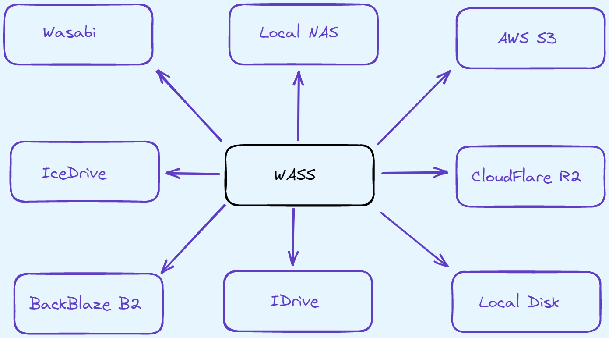
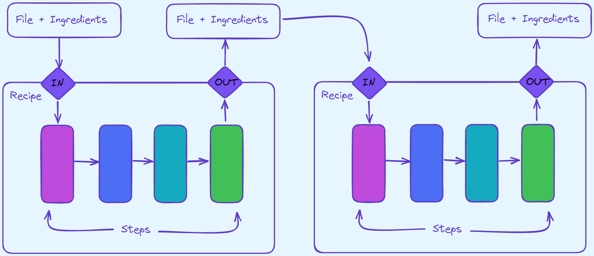

# WASS
Web Attached SStorage: a place to store all your stuff.  

[PM> Install-Package WASS](https://www.nuget.org/packages/WASS/)  

## Intro

Like a NAS (*Network Attached Storage*), but with a web focus.  
The extra **S** in WAS**S**, is so the pronunciation is the same as NAS.  
WASS aims to be your backup, and access solution for your private files.  
This project is meant to be consumed by other UIs, such as a console app, website, or a desktop app.  

## Steps

A recipe is complied from a list of steps, which controls what happens to files presented to WASS.  
A step can be sync, or async; and they perform some kind of operation on the file.  
For example, you might change the file's name, encrypt the file's data, store to S3; etc.  
You may have another recipe as a step in your recipe.  

## Ingredients

Some steps in a recipe may require special "ingredients".  
Think of these as parameters, or arguments to a function.  
For example, you might define a algorithm to a hash step, or the storage tier for S3.  

# Credits
* [Icon](https://www.flaticon.com/free-icon/bird_2630452) made by [Vitaly Gorbachev](https://www.flaticon.com/authors/vitaly-gorbachev) from [Flaticon](https://www.flaticon.com/).

# Changelog

## 0.0.1

* Upload empty project to git / nuget.