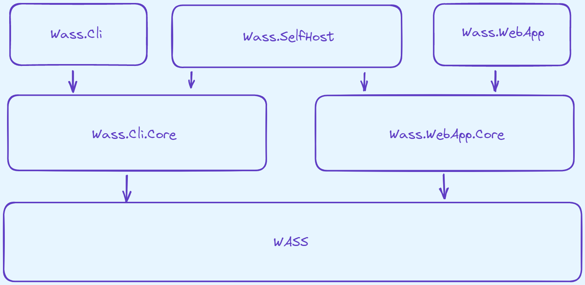

# WASS
Web Attached SStorage: a place to store all your stuff.  

[PM> Install-Package WASS](https://www.nuget.org/packages/WASS/)  

## Intro

Like a NAS (*Network Attached Storage*), but with a web focus.  
The extra **S** in WAS**S**, is so the pronunciation is the same as NAS.  
WASS aims to be your backup, and access solution for your private files.  
This project is meant to be consumed by other UIs, such as a console app, website, or a desktop app.  

## Recipe

A recipe is complied from a list of steps, which controls what happens to files presented to WASS.  
A step can be sync, or async; and they perform some kind of operation on the file.  
For example, you might change the file's name, encrypt the file's data, store to S3; etc.  
You may have another recipe as a step in your recipe.  

## Ingredients

Some steps in a recipe may require special "ingredients".  
Think of these as parameters, or arguments to a function.  
For example, you might define a algorithm to a hash step, or the storage tier for S3.  
Where appropriate, default values are pulled from the config settings, environment variables; or user files.  

## Steps

A recipe consists of one, or more steps.  
A file will pass though steps as it is sent to a target location.  
For example, you might have a recipe that has the following steps:  
* `FilterFileSizeStep:` LessThan 10GB
* `CompressFileDataStep:` GZip
* `EncryptFileDataStep:` AES256
* `AwsS3StorageStep:` Glacier

This recipe will filter out files >= 10GB in size, compress filedata (_gzip_); encrypt filedata (_aes-256_), then upload to it S3 (_glacier storage_).  
How you use the steps will differ based on the WASS UI (_i.e. console / web / etc_), you can find their descriptions; and ingredients below.  

[Step Descriptions]

### AwsS3StorageStep

Uploads a file to S3.  

Ingredients:  
* `bucket:` the bucket name to upload the file to.
* `storage:` the storage class to use for this file.

## Philosophy

WASS does not support deletes.  
If you would like to remove something from storage, you must do so manually by going to your 3rd party storage console, or local drive interfaces.  
In the same vein, WASS does not support updates. If you update a file to "empty", that's the same as deleting it.  

Why? Because if you are backing up a file though WASS, it is important to you; and you do not want to lose it by deleting, or updating local files.  
We want to avoid replicating file changes to backup locations.  
By not implementing this functionity in WASS, it will be harder for WASS to lose your data though any program bugs.  
Ideally any api keys you provide contain create-only semantics, as an extra layer of protection.  

WASS treats files as immuable objects, all changes are handled with additions, not overwrites (_a file is identified by it's hash_).  
WASS generally does not use immuable polices provided by 3rd party systems, as they are not fully consistent across the board.  
i.e. your local NAS does not have a data governance policy that WASS can enable with an API call.  
That said there is nothing stopping you from adding them yourself, WASS does not care as long as it still has read; and write permissions.  

WASS will enable some protections to prevent program bugs from wiping out data.  
These include things like object versioning in AWS S3, and setting read-only attributes for local files.  

When uploading a file though WASS, firstly we search for the hash at the target server.  
If it exists, we do not upload the file data; but we may still upload metadata (_such as the source path, or search tags_).  

WASS handles metadata the same way as files - immuable & create-only.  
For example when adding _tags_ for a file, we do not have a tags file that is updated over time.  
Instead new files are created under a path stemming from the file's hash value, containing the necessary data.  

As a side note, this philosophy makes WASS a poor choice for backing up things you are currently working on.  
If you are writing a story let's say, each time you saved it; WASS will treat it as a new file (_since the hash has changed_).  
Over time, you might have hundreds of files for your story (_or more!_).  
This gets worse when the work is something larger, for example a photoshop file; or a video that you're editing.  
Therefore, I would not keep any working directories under a target location used by WASS.  

## TODO

* `Wass.Cli` - global dotnet tool to administer WASS though the console.
* `Wass.WebApp` - aws lambda to provide file access over the web, + [Progressive Web App](https://web.dev/add-manifest/) for moblie.
* `Wass.SelfHost` - shares functionality from __Wass.WebApp__, and __Wass.Cli__ to run WASS locally.

## CDN

When viewing content from WASS (_online_), it's a good idea to use a CDN.  
WASS does not natively support CDNs, but using one on top is fine.  
Here are some popular ones:  

* [Bunny](https://bunny.net/cdn/)
* [Cloudflare](https://www.cloudflare.com/cdn/)
* [Fastly](https://www.fastly.com/products/cdn)
* [Keycdn](https://www.keycdn.com/)
* [Cloudfront](https://aws.amazon.com/cloudfront/)

Note that media (_video_) streaming though CDNs is typically sold as a separate / specialised product.  
WASS can pull directly from the source (_without a CDN_), but you may encounter bandwidth limitations; or get charged comical egress traffic fees.  

# Credits

* [Icon](https://www.flaticon.com/free-icon/bird_2630452) made by [Vitaly Gorbachev](https://www.flaticon.com/authors/vitaly-gorbachev) from [Flaticon](https://www.flaticon.com/).

# Changelog

## 0.0.1

* Upload empty project to git / nuget.